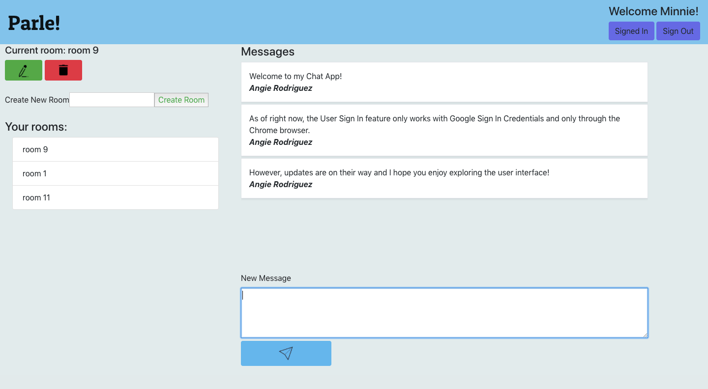
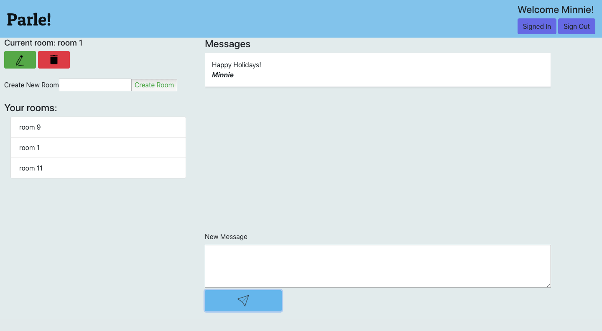
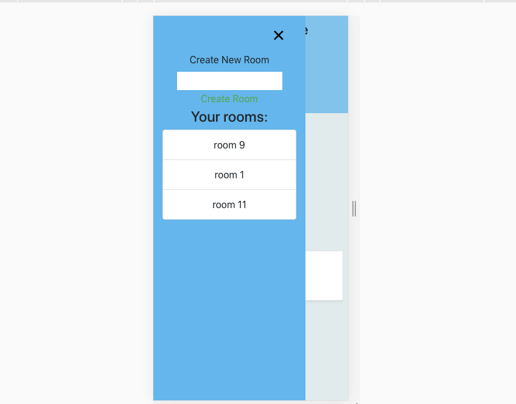

# Parle!

Parle! was bootstrapped with [Create React App](https://github.com/facebook/create-react-app).

## Description
Parle! is a React.js interactive chat app developed with organization in mind. Built with Google's Firebase BaaS, users can send messages in real time by creating separate chat rooms. Users also have the ability to delete their chat rooms, which in turn deletes the room's messages.

Thanks to Firebase, rooms and messages are stored as objects inside a Firebase database. This creates more ease for performing various CRUD actions including creating and deleting.  

## Current Features:
* View, create, edit and delete chat rooms
* Read and write messages
* User sign-up and log-in
* Responsive design (mobile-friendly)



## Motivation

Parle! was inspired by the everyday need to communicate with others via simplistic and enjoyable methods. In the French language, the verb for "to speak" is _parler_. As such, _parle!_ is the imperative for saying "(you) Speak!" The goal of Parle! is to provide a simplistic and classic experience for communicating with friends and family and on any device.

## Viewing the Project

Working demo availble here (hosted on Firebase): https://my-firebase-react-chatapp.firebaseapp.com/


# Getting Started

## Prerequisites
* A computer running MacOS, Windows or Linux
* A supported version of Node.js
* Either yarn or npm to manage packages 
* React.js installed
* A Firebase account

Firebase is a BaaS provided by Google, so all you need to get started is a Google Account. 

Make sure you have React installed. The simplest way is through the npm package manager. If you haven't installed npm or Node.js here's a link to a Codecademy article for installing both and getting up and ready with React:

https://www.codecademy.com/articles/react-setup-i

## Installing

How to get a development environment running on your local server:

Clone this repo inside a directory on your local machine

`$ git clone https://github.com/ARodriguezHacks/parle-app.git`

or

`$ git clone https://github.com/ARodriguezHacks/parle-app.git your-preferred-name-for-project`

Running `git clone` will create a new directory on your local machine called "parle-app" unless you specified a different name for the directory. Change directory (`cd`) into your newly cloned directory

`$ cd parle-app` or `$ cd your-preferred-name-for-project`

Next run `npm install` to install the project's dependencies

`$ npm install`

Once `npm install` has finished installing, you can now run the project on your local server

`$ npm start`

Now you can start chatting away!


Although guest users can only read and create messages, they will still be saved in the project's Firebase database. Only signed-up users can create and delete new chat rooms.

## Technologies/Frameworks used:

* HTML5
* Bootstrap 4 (CSS)
* React.js (JavaScript) 
* Firebase 

## Sample Code:

The sample code below is demonstrating the RoomList component for creating new chat rooms. By importing Firebase we're able to make a call to the project's Firebase database, specifically references to paths. In this example, 'rooms' and 'messages' are names of the paths that exist in the database, and within each path is where our rooms and messages are contained as objects. Rooms objects contain "name" and "username" keys, whereas Messages contain additional keys:

RoomList.js
```
import React, { Component } from 'react';
import * as firebase from 'firebase';

class RoomList extends Component {
  constructor(props) {
    super(props);
    this.state = {
      rooms: [],
      name: '',
      username: ''
    };

    this.roomsRef = this.props.firebase.database().ref('rooms');
    this.messagesRef = this.props.firebase.database().ref('messages');
  }

  componentDidMount() {
    this.roomsRef.on('child_added', snapshot => {
      const room = snapshot.val();
      room.key = snapshot.key;
      this.setState({ rooms: this.state.rooms.concat( room ) });
    });
  }

```

MessageList.js:
```
import React, { Component } from 'react';

class MessageList extends Component {
  constructor(props) {
    super(props);
    this.state = {
      messages: [],
      username: '',
      content: '',
      sentAt: '',
      roomId: ''
    };

```

## Additional Screenshots: 



_Mobile Friendly_


## How to Contribute

If you would like to contribute to Parle! please send an email to angrodri902@gmail.com
