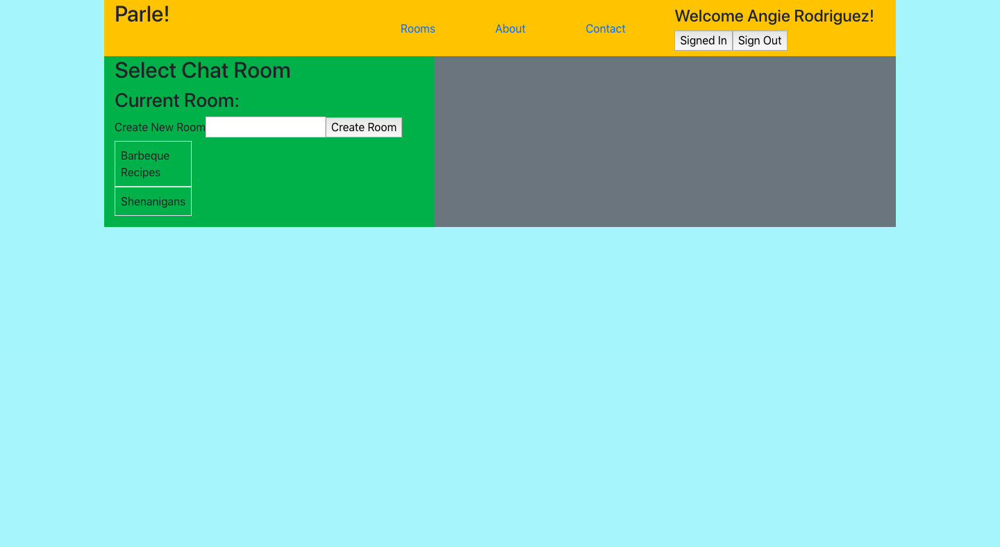
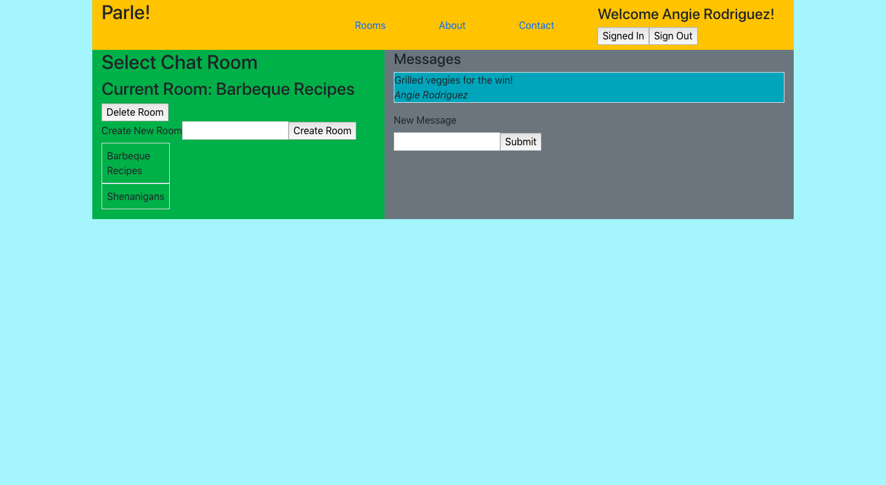
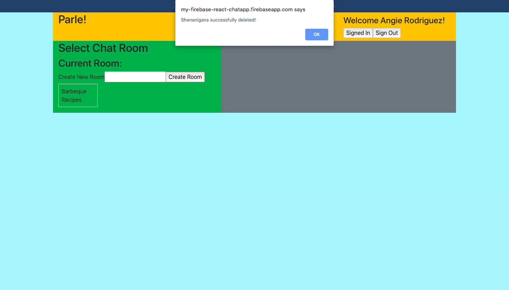

# Parle!

## Description
Parle! is the latest and bestest chat app. Built on the Firebase BAAS, users can sign up or sign in and start chatting away! Parle!'s main feature is creating rooms for separating topics and their corresponding messages.   

Guest users can visit different rooms, and read and write messages; however, they must sign in to start creating their own rooms and receiving additional access such as editing their own messages. 

Working demo availble here (hosted on Firebase): https://my-firebase-react-chatapp.firebaseapp.com/


## Technologies Used:

JavaScript, ReactJS, Firebase, Bootstrap 4

## Getting Started

Make sure you have React installed. The simplest way is through the npm package manager. If you haven't installed npm or Node.js here's a link to a Codecademy article for installing both and getting up and ready with React:

https://www.codecademy.com/articles/react-setup-i

# Installing

`git clone git@github.com/ARodriguezHacks/travel-bucket-app.git` or create a fork.

## Sample Code:

```
import React, { Component } from 'react';

class RoomList extends Component {
  constructor(props) {
    super(props);
    this.state = {
      rooms: [],
      name: ''
    };

    this.roomsRef = this.props.firebase.database().ref('rooms');
  }

  componentDidMount() {
    this.roomsRef.on('child_added', snapshot => {
      const room = snapshot.val();
      room.key = snapshot.key;
      this.setState({ rooms: this.state.rooms.concat( room ) });
    });
  }

  handleChange(e) {
    e.preventDefault();
    this.setState({ name: e.target.value });
  }

  createRoom(e) {
    e.preventDefault();
    this.roomsRef.push({
      name: this.state.name
    });
    this.setState({ name: '' });
  }

```

## Screenshots: 






----------------------------------------

This project was bootstrapped with [Create React App](https://github.com/facebook/create-react-app).
